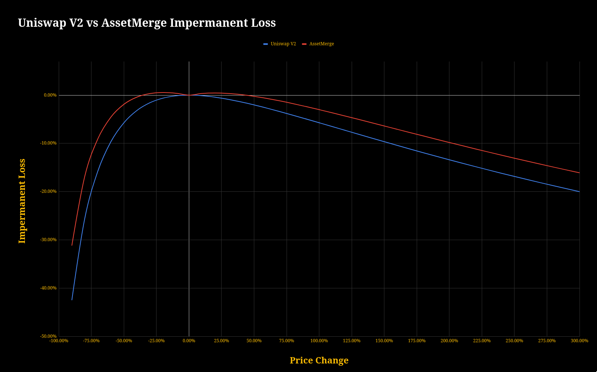
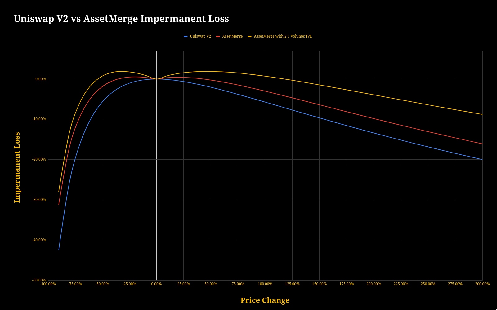

# Impermanent Loss (IL)

## What is Impermanent Loss?

Impermanent loss is the difference between holding tokens in an AMM and holding them in your wallet.
If you were to hold 1 ETH and 1 ETH worth of some NFT collection, you will generally be better off holding in your wallet then allocating the same assets in an AMM liquidity pool.

The trade-off for providing liquidity is that you get to have some exposure to both asset types as well as earning yield earned from swap fees, at the opportunity cost of gaining less asset appreciation.

> Bancors' [Beginner’s Guide to (Getting Rekt by) Impermanent Loss](https://blog.bancor.network/beginners-guide-to-getting-rekt-by-impermanent-loss-7c9510cb2f22)

## UniswapV2 vs AssetMerge
Both UniswapV2 and AssetMerge follow the same constant product formulae. But due to how AssetMerge changes weights of NFTs during swaps the value of the pool grows with volume, making the opportunity costs of providing liquidity in AssetMerge decrease when volume increases. The following chart does not take trade fees into consideration for any curves.

## NFT Delta and Swap Volume
The invariant increases from each swap due to the protocol fee and NFT delta, so impermanent loss improves with more volume.
Here is an example comparing IL from price changes if the LP was just added and after an additional volume equal to the pools TVL.

