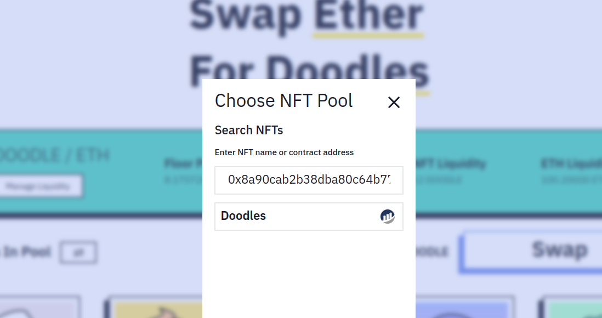
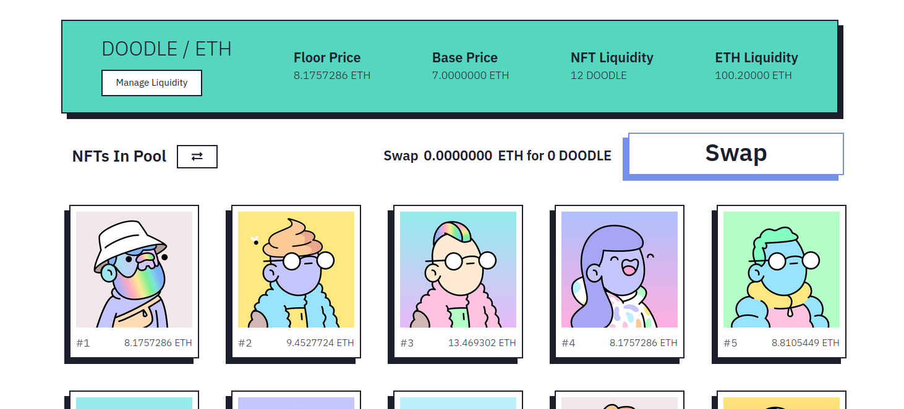
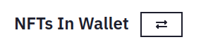
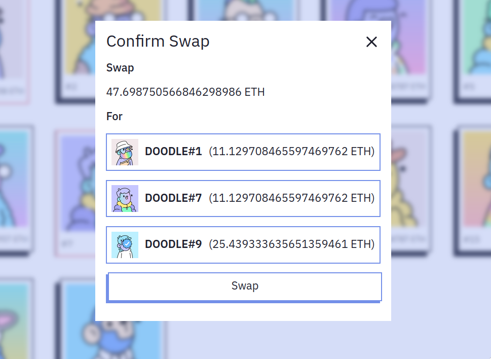

# Making A Swap

Enter the **[AssetMerge App](https://assetmerge.xyz/app/)** to start swapping NFTs.

## Select The Pair

To change pairs, click the name of a token to bring up the token selector.

## View Pool & Listings
Here you can see pool details, such as pair name, TVL, and price statistics.
Below you can toggle between viewing NFTs in the pool and NFTs in your wallet, select 1 or more NFTs you want to trade and click swap to make the trade.

:::tip Buy Or Sell Items
On the swap page, [https://assetmerge.xyz/app](https://assetmerge.xyz/app), click the toggle button to switch between buying or selling.

:::

## Select Items And Confirm Swap

Simply select the items you want to trade, click Swap and finally confirm the trade on the confirmation pop-up.

