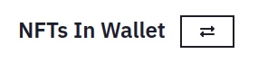

# Providing Liquidity

Anyone can provide liquidity, all you need is at least 1 NFT you want to provide and Ether worth the same value as the NFTs you are providing.

:::tip Add Or Remove Liquidity
On the provide page, [https://assetmerge.xyz/app/liquidity](https://assetmerge.xyz/app/liquidity), select the pair you want to provide liquidity for and then make sure you are viewing your NFT balance.

:::

## Select NFTs

**You are not guaranteed to get the same NFTs back when you remove liquidity, so don't add anything you want to keep.**

## Set Prices of the NFTs

The NFTs will be given a suggested price if there is already liquidity in the pool, or missing price if you are the first liquidity provider.
You can always set your own price, and it is recommended to make sure the prices are set at the market valuation.

# Confirm Prices And Add

If you are the first LP provider for a pair, you will need to set the Base Price. This should be set to the current collection's floor price. Although a base price and floor price in AssetMerge are not the same thing, most LP providers should treat the initial base price as floor.
To read more about the pricing mechanics read [How Does Pricing Work](/docs/mechanics/how-does-pricing-work)

