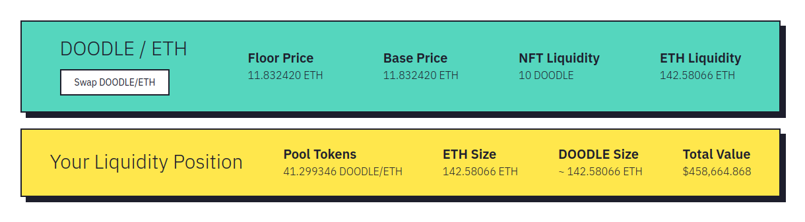

# Removing Liquidity

When you have added liquidity, you will be given pool LP tokens. These represent your share of the liquidity pools ETH and NFTs.

When removing LP you can withdraw any NFTs in the pool, as long as the sum prices are less or equal to the value of your position.

Select any NFTs you want to withdraw, within the value of your position. And then confirm the action.
